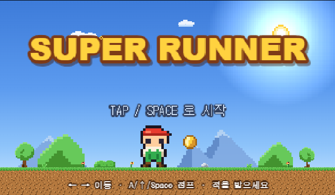
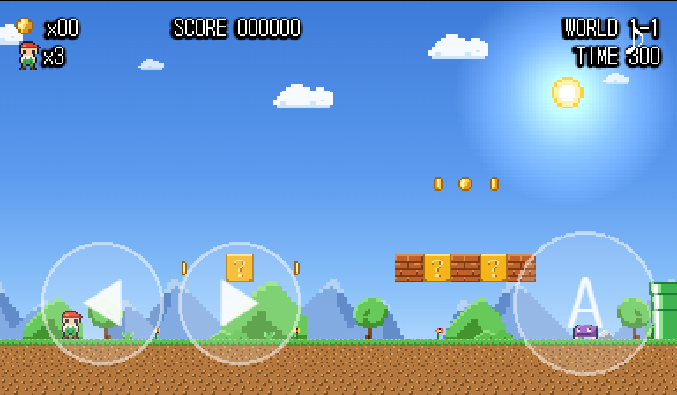
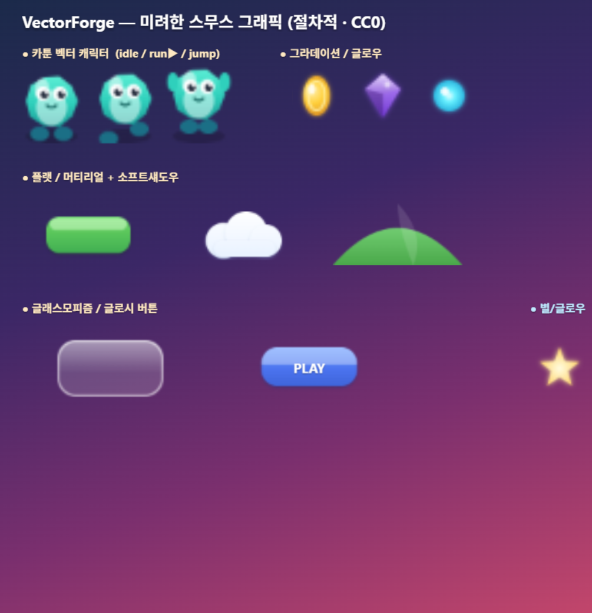

# WebGameForge

> **"슈퍼마리오 게임 만들어줘"** 한마디로, 모바일 웹뷰에서 잘 돌아가는 완성도 높은 2D 웹 게임을 자동으로 벼려내는 **Claude Code 플러그인**.


기존 클로드 코드에 "웹 게임 만들어줘"라고 하면 바닐라 JS 수준의 투박한 결과가 나옵니다.
**WebGameForge는 게임 제작 의도를 자동 감지**해, 검증된 엔진 스택(Phaser 4(4.1.0) + 절차적 에셋/사운드 +
모바일 하니스)과 전문 스킬 27종으로 **스프라이트 애니메이션·HUD·터치 컨트롤(디지털 D-패드+아날로그 가상조이스틱)·장르별 사운드(8비트 칩튠부터
신스웨이브·앰비언트·적응형 음악까지) 갖춘 게임**을 만들어 줍니다.

> 플러그인 내부 식별자는 `web-game-builder` 입니다(슬래시 커맨드·스킬 네임스페이스에 사용).
> **WebGameForge** 는 프로젝트/저장소 브랜드명입니다.

<p align="center">
  
  
</p>

---

## ✨ 주요 특징

- **🪄 자동 발동** — "슈퍼마리오 만들어줘", "make a platformer", "탑다운 슈팅 만들어줘" 같은 자연어만으로
  관련 스킬이 자동 트리거됩니다. 별도 명령 암기가 필요 없습니다.
- **🎮 Phaser 4 기반** — Arcade 물리·타일맵·스프라이트 애니메이션·카메라 추적·HUD가 전부 1급 API로
  내장된 엔진(vendored `engine/phaser.min.js`, v4.1.0, MIT)을 사용합니다.
- **📱 모바일 웹뷰 대응** — iOS WKWebView, 카카오/인스타 인앱 브라우저까지 커버하는 Scale.FIT,
  'Tap to start' 오디오 언락, 멀티터치 가상 D-패드+점프 버튼이 기본 포함됩니다. 탑다운·트윈스틱·러너에는
  아날로그 **가상조이스틱**(`JoystickKit` — 360° 방향+세기·이동/조준 분리)을 D-패드와 장르별로 골라 씁니다.
- **🎨 두 가지 아트 스타일** — 픽셀아트(`PixelForge`)와 **미려한 스무스/벡터**(`VectorForge` —
  그라데이션·글로우·소프트섀도우·글래스모피즘·곡선 캐릭터)를 모두 코드로 생성합니다. 게임당 한 스타일.
- **⚖️ CC0 / IP-safe 에셋** — 외부 파일 없이 절차적으로 생성하거나, 외부 HD CC0 아트를 라이선스
  게이트(`assets.json`, CC0만)로 로딩합니다. 닌텐도 등 타사 에셋·이름·시그니처 조합을 쓰지 않습니다.
- **🔊 8비트 너머 사운드** — `sound-architect` 디렉터가 무드 인터뷰로 사운드를 설계하고, `SoundForge`(vendored
  Tone.js v15)가 ADSR·필터·슈퍼소우·FM·노이즈 퍼커션·절차 리버브·**적응형 레이어드 음악**을 코드 합성합니다 —
  칩튠·신스웨이브·앰비언트·로파이·아케이드. 아주 작은/레트로 게임은 `ChipAudio` 8비트 경량 레인(`chip-sound`).
  오디오 파일 0개, 100% CC0(절차 합성 오리지널).
- **🧩 29종 스킬 체계** — 장르 스캐폴드 5 + 제작요소 13(서사·**능력**·아이템·**사운드** 디렉터 포함) + **Phaser 고급 5**(Matter 물리·포스트FX·라이팅·경로·**가상조이스틱**) + 품질·운영 5 + 메인 오케스트레이터.
- **📖 게임 서사 설계** — `story-architect`가 톤·스토리·목표·캐릭터·대사·반전을 탑다운 인터뷰로 설계해
  `STORY.md` 스토리 바이블로 산출하고 인트로/막간/엔딩·환경 단서·NPC 대사로 입힙니다(전형 vs 참신 선택, 대사 자동 작성, 연속성 린트).
- **🎒 게임 아이템 설계** — `item-architect`가 소모품·장비·특수기능·통화·시너지 등 **습득·사용하는 모든 것**을
  탑다운 인터뷰(복잡도부터, 디폴트 0개)로 설계해 `ITEMS.md` 바이블 + `items.json` 데이터로 산출합니다. 각 아이템의
  **visual.\* 묘사 슬롯**(실루엣·재질·팔레트·등급 시각언어)을 채워 `sprite-forge`/`vector-graphics`/`sprite-picker`가
  좋은 아이콘을 만들게 하고, 무의존성 `lint-items.mjs` validator로 죽은아이템·지배전략·곱연산 폭발을 기계 검증합니다.
- **🎮 캐릭터 능력/스킬 시스템 설계** — `ability-architect`가 캐릭터의 **능력 전체**(액티브·패시브·이동기·궁극기·자원·
  쿨다운·콤보·스킬트리·시너지·진행)를 탑다운 인터뷰(복잡도부터, 플랫포머 더블점프 한 개 ~ 디아블로급 스킬트리)로 설계해
  `ABILITIES.md` 바이블 + `abilities.json` 데이터로 산출하고, `engine/abilitykit.js`(쿨다운·자원·콤보·게이트 런타임)로
  게임에 입힙니다. 능력을 **획득→조합(시너지·콤보)→사용**하는 재미가 1순위. 무의존성 `lint-abilities.mjs` validator로
  죽은스킬·지배전략·곱연산폭발·무한콤보·게이트softlock을, `sim-abilities.mjs`로 빌드별 DPS·자원 지속성을 기계 검증합니다.
  *(여기서 '스킬'은 게임 캐릭터의 능력 — Claude 스킬과 다릅니다.)*
- **🖼 스프라이트 시각 선택** — 화면 비주얼은 재미의 핵심이라 사용자가 **직접 고르게** 합니다.
  `sprite-picker`가 라이선스-안전(CC0) 스프라이트/스프라이트시트를 **브라우저 갤러리에서 클릭 선택**하게
  하고(카탈로그·로컬 파일·이전 사용분), 캐싱으로 매번 웹을 뒤지지 않습니다. 카탈로그 갱신은 `sprite-catalog-refresh`.
- **🧬 게임 DNA 템플릿** — 인기 2D 게임 35종의 재미 요소를 분석한 레퍼런스(`reference/game-dna/`).
  명확화 단계에서 "어떤 게임 만들지" 제안하고, 재미요소를 조합해 새 게임으로 녹입니다(메카닉만 차용, IP-safe).
- **✅ 실제 실행 검증** — 헤드리스 step 하니스로 이동·충돌·메카닉을 결정적 검증. 데모 `super-runner`
  는 600프레임 연속 플레이 콘솔 에러 0으로 통과했습니다.
- **현재 범위: 2D 전용** — 플랫포머가 플래그십, 슈팅·아케이드·퍼즐·러너로 확장.

---

## 🚀 빠른 시작

### 설치

마켓플레이스를 등록합니다:

```
/plugin marketplace add v0o0v/web-game-forge
```

플러그인을 설치합니다:

```
/plugin install web-game-builder@web-game-builder-marketplace
```

로컬 개발 환경에서 유효성 검사:

```
claude plugin validate ./ --strict
```

### 사용

자연어로 그냥 요청하면 됩니다:

```
슈퍼마리오류 플랫포머 게임 만들어줘
```

또는:

```
make a top-down shooter with waves of enemies
```

명시적 슬래시 커맨드로도 호출할 수 있습니다:

```
/web-game-builder:wgf-make-game 벽돌깨기 게임
```

세부 작업도 해당 전문 스킬이 자동으로 잡습니다 — "효과음 추가해줘", "레벨 하나 더 만들어줘",
"모바일에서 최적화해줘", "60fps로 만들어줘" 등.

### 데모 실행

프로젝트 루트에서 로컬 서버를 실행합니다:

```
python -m http.server 8766
```

브라우저에서 접속합니다:

```
http://127.0.0.1:8766/games/super-runner/index.html
```

---

## 🕹 데모: super-runner

`games/super-runner/`에 포함된 슈퍼마리오류 플랫포머 데모입니다. 100% 절차적(CC0/IP-safe) 에셋.

### 조작법

| 입력 | 동작 |
|------|------|
| ← / → | 좌우 이동 |
| ↑ / A / Space | 점프 |
| 화면 터치 | 모바일 가상 D-패드 + A 버튼 |

### 구현된 메카닉

- **이동**: 가속·마찰 기반 좌우 이동, 달리는 애니메이션
- **점프**: 가변 높이(버튼을 오래 누를수록 높이), 코요테 타임, 점프 버퍼
- **카메라**: 플레이어를 부드럽게 추적하는 수평 스크롤
- **코인**: 획득 +100점 + 효과음
- **물음표 블록**: 아래서 치면 코인 팝업(+200점) 또는 버섯 등장
- **적(보라 슬라임)**: 밟아 처치 +100점, 부딪히면 목숨 감소(큰 상태면 작아짐)
- **파워업(초록 버섯)**: 먹으면 몸집이 커짐(+1000점)
- **HUD**: 코인 카운트 / SCORE / WORLD / TIME / 목숨(주인공 아이콘 ×N)
- **타이틀 화면**: 'TAP TO START' → 오디오 언락 후 게임 시작
- **목숨·구덩이·게임오버**: 구덩이 추락/피격 시 목숨 감소, 0이면 게임오버(registry 영속)
- **캐릭터**: '빨간 모자 러너' — 오리지널(닌텐도 마리오 미사용)

---

## 🎨 아트 스타일

게임당 한 가지 렌더 스타일을 택합니다 — 둘 다 외부 다운로드 0, 코드 생성(CC0/IP-safe).

- **픽셀아트** (`PixelForge`, `pixelArt:true`) — NES풍 레트로. 데모 `games/super-runner/` 참고.
- **미려한 스무스/벡터** (`VectorForge`, `pixelArt:false`) — 그라데이션·글로우·소프트섀도우·
  글래스모피즘·곡선 캐릭터. 4가지 스타일 쇼케이스: `games/style-preview/`.



필요하면 외부 HD CC0 아트(SVG/래스터)도 `assets.json` 라이선스 게이트로 로딩합니다.

### 🖼 스프라이트 직접 고르기 — `sprite-picker`

화면에 보이는 이미지·애니메이션은 게임의 재미를 가장 크게 좌우하므로, **사용자가 직접 고를 수 있게**
합니다. `sprite-picker` 스킬은:

- **시각적 선택(대상 배정)** — 라이선스-안전 스프라이트를 **브라우저 갤러리**에서 눈으로 구분하고,
  **적용 대상 슬롯**(플레이어·적·코인…, 설명 포함)에 **클릭/드래그로 배정**합니다(순서 외워 찍기 X).
  후보는 수십~수백 개를 검색·필터로 좁힙니다. **"✓ 선택 완료"** 를 누르면 컴패니언 서버(`picker/serve.mjs`)가
  선택을 파일로 저장해 Claude가 **자동 회수**합니다(붙여넣기는 폴백).
- **3가지 출처** — ① 큐레이션된 CC0 카탈로그(Kenney·OpenGameArt 등, 라이선스 적대적 검증), ② 사용자
  로컬 파일, ③ `assets-library/`에 쌓인 **이전 사용분** — 또는 ④ 설명을 받아 `sprite-forge`/`vector-graphics`
  로 **절차 생성**(위임). 게임 생성 시 "실제 에셋 vs 절차 생성"을 먼저 묻습니다.
- **캐싱 우선** — 카탈로그는 미리 조사·검증해 `skills/wgf-sprite-picker/catalog/`에 캐싱되어 **매번 웹을
  뒤지지 않습니다.** 외부 재조사는 `sprite-catalog-refresh`로 사용자가 명시 요청할 때만.
- **로컬 라이브러리** — 한 번 쓴 스프라이트는 `assets-library/`에 보관해 언제든 다시 고릅니다.
- **끈질긴 인터뷰** — 의도가 모호하면 탑다운 1문1답으로 스타일·에셋 목록·애니·라이선스·적용 매핑을 캐묻습니다.

> 안전 티어(`cc0`/`permissive-attribution`/`mixed-per-item`/`avoid`)로 라이선스를 등급화하며, 최종
> 게이트는 `ip-license-guard`·루트 `assets.json`입니다. 닌텐도 등 상용 IP 리핑 소스는 카탈로그에 넣지 않습니다.

---

## 🧩 스킬 카탈로그 (29종)

메인 `web-game-builder`가 전체 흐름을 조율하고, 요청 성격에 따라 전문 스킬이 자동 발동합니다.
**장르로 스캐폴드 → 제작요소로 살붙이기 → 품질로 검증·최적화** 순서로 협력합니다.

| 분류 | 스킬 | 역할 |
|------|------|------|
| 메인 | `web-game-builder` | 게임 제작 요청 감지·오케스트레이션 |
| 🎮 장르 | `platformer-game` | 옆스크롤 플랫포머(마리오류) |
| | `topdown-shooter` | 탑다운/트윈스틱 슈팅 |
| | `arcade-classic` | 벽돌깨기·뱀·퐁·인베이더 |
| | `puzzle-game` | 테트리스·매치3·2048 |
| | `endless-runner` | 무한 러너·플래피류 |
| 🛠 제작요소 | `sprite-picker` | **실제 스프라이트/시트/애니를 브라우저 갤러리에서 시각적으로 골라 적용**(CC0 카탈로그·로컬·이전 사용분) + 캐싱·로컬 라이브러리 |
| | `sprite-forge` | PixelForge 픽셀아트 스프라이트·애니메이션(절차 생성) |
| | `vector-graphics` | VectorForge 미려한 스무스/벡터 그래픽 + 외부 HD CC0 로딩(절차 생성) |
| | `sound-architect` | 무드·BGM·효과음·**적응형 음악** 게임 **사운드 설계**(8비트 너머) + `SoundForge`(Tone.js v15)·`AUDIO.md` 바이블·`audio.json`·무드→음악 매핑·`lint-audio.mjs` 검증 |
| | `chip-sound` | ChipAudio 8비트(칩튠) 경량 효과음·BGM (T0 레인) |
| | `world-map-architect` | 스테이지를 잇는 **진행 맵 위상**(선형·사가·분기 노드맵·액트·허브·무한) 설계 + 맵 화면 빌드 |
| | `level-architect` | 게임 분석·의도 인터뷰·난이도 곡선·재미 극대화 레벨 **설계** |
| | `story-architect` | 톤·스토리·목표·**캐릭터·대사·반전** 게임 **서사 설계** + `STORY.md` 바이블·전형↔참신·대사 자동 작성·연속성 린트 |
| | `ability-architect` | 액티브·패시브·이동기·궁극기·자원·쿨다운·**콤보·스킬트리·시너지** **캐릭터 능력/스킬 시스템 설계**(Claude 스킬 아님) + `ABILITIES.md` 바이블·`abilities.json`·`engine/abilitykit.js` 런타임·복잡도 게이트·visual.* 아이콘 핸드오프·`lint-abilities.mjs`/`sim-abilities.mjs` 검증 |
| | `item-architect` | 소모품·장비·특수기능·통화·**시너지·획득** 게임 **아이템 설계** + `ITEMS.md` 바이블·`items.json`·복잡도 게이트·visual.* 아이콘 핸드오프·`lint-items.mjs` 밸런스 검증 |
| | `level-designer` | 레벨·맵(타일맵) **빌드**(구현 패턴) |
| | `game-ui-hud` | HUD·메뉴·UI 화면 |
| | `juice-fx` | 파티클·스크린셰이크·게임필 |
| 🧩 Phaser 고급 | `matter-physics` | Matter 강체 물리(슬링샷·쌓기·물리퍼즐·래그돌) — Arcade 로 못 하는 회전·충격·무너짐 |
| | `screen-fx` | 포스트FX 화면 룩(블룸·비네트·CRT·네온 글로우·컬러그레이딩) — v4 Filter, 전 장르 폴리시 |
| | `lighting-mood` | 동적 라이팅·분위기(PointLight·Simplex Noise 안개·Gradient 밤하늘·앰비언트) |
| | `path-motion` | 경로·모션(스플라인 패트롤·방사 탄막·타워디펜스 크립·앰비언트 드리프트) |
| | `virtual-joystick` | 가상 조이스틱(아날로그/트윈스틱) 터치 컨트롤 — 360° 방향+세기·이동/조준 분리. 디지털 D-패드와 장르별 공존 |
| ✅ 품질·운영 | `mobile-webview-tune` | 모바일 웹뷰 최적화·감사 |
| | `game-qa` | 헤드리스 step 하니스 동작 검증 |
| | `ip-license-guard` | 저작권·라이선스 안전 점검 |
| | `perf-60fps` | 60fps 성능 최적화 |
| | `sprite-catalog-refresh` | sprite-picker의 CC0 소스 카탈로그 웹 재조사·갱신(사용자 명시 요청 시) |

각 전문 스킬은 tight한 description으로 관련 요청에만 발동하도록 설계해 스킬 listing 예산
(컨텍스트 ~1%)을 관리합니다(개별 캡 1,536자 내).

### 📚 Phaser 4 API 레퍼런스 라이브러리

`skills/wgf-web-game-builder/reference/phaser/` 디렉터리에 **Phaser 공식 v4 에이전트용 스킬 문서
28종 + INDEX.md** 를 벤더링하고 있습니다. 게임 생성 시 우리 스킬들이 이 레퍼런스를 직접 참조해
Phaser 4 API 의 정확한 사용법(씬 라이프사이클·물리·스케일·입력·파티클 등)을 LLM 코드생성에
반영합니다. 벤더링 출처: Phaser 공식 skills(MIT 라이선스). v3 API 혼용으로 인한 코드생성 오류를
원천 차단합니다.

### 🧬 게임 DNA 레퍼런스 라이브러리

`skills/wgf-web-game-builder/reference/game-dna/` 디렉터리에 **지난 10여 년간 많은 사람이 플레이한
2D 게임 35종의 재미 요소 분석**을 담았습니다. 플랫포머(Celeste·Hollow Knight·Cuphead…),
러너(Flappy Bird·Geometry Dash·Canabalt…), 아케이드(Snake·Crossy Road·Pac-Man…),
퍼즐(Tetris·Candy Crush·2048·Baba Is You…), 슈터·로그라이트(Vampire Survivors·Brotato·Geometry Wars…),
물리·메가히트(Angry Birds·Cut the Rope·Plants vs. Zombies…)를 장르별 6개 파일로 분석합니다.

각 게임은 **코어 루프·재미요소(`FE-*` 태그)·메카닉·난이도 곡선·게임필·리텐션·우리 엔진 재현도(✅/⚠️/❌)·
조합 훅·IP 안전 메모** 템플릿으로 분해되며, [`fun-elements.md`](skills/wgf-web-game-builder/reference/game-dna/fun-elements.md)에
**재미요소 사전 21종 + 검증된 조합 레시피 11종 + 안티패턴 + 4단계 조합 설계법**을 정리했습니다.
게임 제작 명확화 단계에서 이 자료로 **"어떤 게임을 만들지" 제안하고, 여러 게임의 재미를 조합해
새 게임에 녹입니다.** 분석 대상은 **메카닉·재미뿐** — 이름·캐릭터·스프라이트·음악 등 저작물은 쓰지 않습니다.
색인·사용법: [`game-dna/INDEX.md`](skills/wgf-web-game-builder/reference/game-dna/INDEX.md).

**🧩 퍼즐 심화 서브라이브러리** — 퍼즐은 별도로 **35종 심화 분석**(`game-dna/puzzle/`)으로 확장했습니다.
낙하·실시간(Tetris·Puyo Puyo·Dr. Mario·Lumines·Puzzle Bobble), 매치·병합(Bejeweled·Candy Crush·Puzzle & Dragons·2048·Threes),
논리·연역(Sudoku·Picross·Minesweeper·Wordle·Flow Free), 공간·물리·규칙(Sokoban·Baba Is You·Monument Valley·Lemmings·Cut the Rope),
그리고 **유명 퍼즐 보드게임 15종** — 드래프트·패턴(Azul·Sagrada·Kingdomino·Cascadia·Take It Easy),
폴리오미노·패킹(Patchwork·Blokus·Ubongo·NMBR 9·Project L), 세트·재배열·롤앤라이트(Rummikub·SET·Qwirkle·Ganz schön clever·Railroad Ink)의
**7개 하위장르 × 5종 + 퍼즐 전용 재미요소 사전(특화 13종 — 연역·규칙발견·공간추론·선계획 + 드래프트·패킹·운길들이기·판재구성·세트로직) + 조합 레시피 20종**
([`puzzle/INDEX.md`](skills/wgf-web-game-builder/reference/game-dna/puzzle/INDEX.md)). `puzzle-game` 스킬이
연역 그리드·규칙조작·공간 푸시·물리 + 드래프트 시장·폴리오미노 패킹·롤앤라이트·세트 재배열 스캐폴드까지 다룹니다.

**🎲 보드게임 아틀라스** — 유명 보드게임 **100종을 컴팩트 카탈로그**(`game-dna/board/`, 2티어)로 추가 분석했습니다.
덱빌딩·엔진빌딩(Dominion·Splendor·Wingspan 등), 푸시유어럭·주사위(Can't Stop·Quacks 등), 타일·경로(Carcassonne·Ticket to Ride 등),
경매·경제(Modern Art·Ra·Catan 등), 워커 플레이스먼트(Agricola·Everdell 등), 협력(Pandemic·Spirit Island 등),
추리·블러프(Mastermind·Coup 등), 추상 듀얼(Hive·Onitama 등), 단어·파티(Scrabble·Codenames 등), 순발력·기억(Dobble·Simon 등)의
**10개 메카닉 클러스터 × 10종** + 전역 재미요소 4종 신설(`FE-DECKCRAFT` 덱 조형·`FE-AUCTION` 경매·`FE-BLUFF` 심리전·`FE-MEMORY` 기억)
([`board/INDEX.md`](skills/wgf-web-game-builder/reference/game-dna/board/INDEX.md)). 게임당 코어·재미요소·메카닉·웹 솔로 번안·조합 훅·IP 주의를 압축 수록해
game-dna 총 **164작**이 명확화 단계의 조합 재료가 됩니다.

---

## ⚙️ 엔진 라이브러리 12종 (`engine/`)

### PixelForge (`pixelforge.js`)
문자 그리드로 정의한 스프라이트를 Phaser 텍스처로 굽는 절차적 픽셀아트 생성기. 외부 이미지 0,
CC0/IP-safe. 라가드 행 자동 패딩으로 픽셀 작업이 덜 실수납니다.

```js
PixelForge.bake(this, 'star', {
  palette: { 'y': '#ffe23f', 'w': '#fff7c0' },
  frames: [ ["..y..", ".ywy.", "ywwwy", ".ywy.", "..y.."] ]
});
```

### VectorForge (`vectorforge.js`)
PixelForge의 비-픽셀 짝꿍. 그라데이션·글로우·소프트섀도우·글래스질·곡선 캐릭터 같은 **미려한**
그래픽을 코드로 생성(슈퍼샘플 안티앨리어스). 외부 0, CC0/IP-safe.

```js
VectorForge.bake(this, 'orb', { w:24, h:24, draw:(ctx,w,h,t,VF) => {
  VF.glow(ctx, 'rgba(70,220,255,0.9)', 9, () => {
    VF.circle(ctx, w/2, h/2, 8);
    ctx.fillStyle = VF.radial(ctx, w/2, h/2, 9, [[0,'#eaffff'],[0.4,'#66f0ff'],[1,'#2bb6e0']]);
    ctx.fill();
  });
}});
```

### SoundForge (`soundforge.js` + vendored `tone.js`)
**8비트 너머**의 게임 사운드 엔진. `Tone.js`(v15, MIT, vendored)를 감싸 ADSR·필터·슈퍼소우·FM·노이즈
퍼커션·절차 IR 리버브/딜레이·**적응형 레이어드 BGM**(인텐시티별 수직 레이어 크로스페이드)·레이어드
SFX(트랜지언트+바디+테일)를 코드 합성. 오디오 파일 0, 100% CC0(절차 합성 오리지널). `Tone.Transport`
샘플정확 스케줄러로 박자 지터 제거. **`ChipAudio`와 동일 인터페이스**(`unlock/resume/suspend/toggleMute/
startBgm/stopBgm/sfx`)라 `mobile.js`가 무수정 동작. `audio.json`을 데이터로 로드, 디렉터 스킬
[`sound-architect`](skills/wgf-sound-architect/SKILL.md)가 무드 인터뷰로 설계.

```js
var GAME_AUDIO = new SoundForge(AUDIO_SPEC);  window.GAME_AUDIO = GAME_AUDIO;
GAME_AUDIO.unlock(); GAME_AUDIO.startBgm();           // 첫 제스처(Tap to start)
GAME_AUDIO.sfx('explosion'); GAME_AUDIO.setIntensity(0.8); GAME_AUDIO.setSection('boss');
```

### ChipAudio (`audio.js`)
Web Audio API만으로 8비트(칩튠) 효과음과 **오리지널** BGM을 코드 합성. 오디오 파일 0, 100% CC0.
첫 사용자 제스처에서 `audio.unlock()`으로 모바일 오디오 언락. 아주 작은/레트로 게임의 경량 레인(`chip-sound`).

### MobileHarness (`mobile.js`)
모바일 웹뷰 베스트프랙티스를 한 곳에: `scaleConfig()`(FIT+CENTER), `installDomGuards()`(iOS 줌/스크롤
차단), `TouchControlsClass()`(멀티터치 D-패드+점프 버튼 Scene).

### TiledForge (`tiled.js`)
Tiled 맵 포맷(.tmj)을 **외부 PNG 없이** 연동. `bakeTileset()`이 `PixelForge`/`VectorForge` 타일을
*한 장의* 아틀라스 텍스처로 절차 베이크해 Phaser 타일셋에 연결(외부 파일 0, CC0/IP-safe).
`loadTiledMap()`이 타일 레이어 충돌을 설정하고 오브젝트 레이어를 게임이 등록한 스포너로 위임한다
(타일 레이어=정적 지형, 오브젝트 레이어=행동). `.tmj` 저작은 `level-to-tmj`(LEVEL→.tmj)·
`ascii-to-tmj`(격자→.tmj) 도구로. 데모: `super-runner ?tiled=1`(절차 경로와 동치)·`tiled-topdown`.

```js
TiledForge.bakeTileset(this, tileDefs, { key:'forge-tiles', name:'forge', tileSize:16, columns:3 });
var res = TiledForge.loadTiledMap(this, 'map', { tilesetKey:'forge-tiles', tilesetName:'forge', spawners:{...} });
this.physics.add.collider(this.hero, res.solids[0]);
```

**고급 기능 4종**(데모 `tiled-iso`·`tiled-pack`):
- **애니메이션 타일** — 타일 def에 `animFrames`/`anim:{frames,duration}` → 프레임마다 연속 GID로 굽고
  Tiled `animation` 배열 자동 emit(Phaser가 CPU·GPU 양쪽 재생).
- **등각/육각 맵** — `ascii-to-tmj`에 `ORIENTATION:'isometric'|'hexagonal'|'staggered'` + 비정방형
  타일. iso/hex는 타일 좌표 논리 이동(`tileToWorldXY`/`getTileAt`).
- **`TilemapGPULayer`** — `loadTiledMap({gpu:true})`로 WebGL 셰이더 레이어(직교 전용, WebGL·iso/hex
  위반 시 CPU 자동 폴백). 편집 후 `res.regenerate()`.
- **외부 CC0 팩 임포트 + `assets.json` 게이트** — `loadTiledMap({licenseGate:{policy,manifest}})`가
  허용 안 된 라이선스를 로드 단계에서 차단. 팩 생성·검증은 `bake-tiled-pack`·`verify-tiled-pack` 도구.

```js
// 외부 CC0 팩을 라이선스 게이트로 임포트 + GPU 레이어로 렌더
var res = TiledForge.loadTiledMap(this, 'pack-map', {
  tilesetKey:'forge-pack', tilesetName:manifest.tilesetName, gpu:true,
  licenseGate:{ policy: assets.policy, manifest: manifest } // CC0/MIT/… 만 통과, 아니면 throw
});
```

> 자세한 API는 [skills/wgf-web-game-builder/reference/engine-api.md](skills/wgf-web-game-builder/reference/engine-api.md).
> Tiled 저작 가이드: [skills/wgf-level-designer/reference/tiled/authoring.md](skills/wgf-level-designer/reference/tiled/authoring.md).

### AbilityKit (`abilitykit.js`)
**캐릭터 능력/스킬 시스템 런타임**(`ability-architect` 디렉터가 설계). `games/<slug>/abilities.json` 을 로드해 능력의
**쿨다운·자원(마나/스태미나)·충전·콤보 윈도·능력 게이트·스킬트리 해금**을 데이터 구동으로 굴립니다. SoundForge 처럼
"스펙 → 실제 동작". **킷은 타이밍·자원만** 관리하고, 능력의 *효과*(대미지·발사체·이동)는 게임이 `onActivate` 콜백에서
실행 → 효과를 코드에 중복 하드코딩하지 않습니다(단일 진실 `abilities.json`).

```js
var KIT = AbilityKit.attach(this, ABILITIES_SPEC, {
  unlockedAtStart: ['dash'],
  onActivate: function (ab, ctx) { applyEffect(ab, ctx); }  // 게임이 효과 실행(ab.effect 읽기)
});
window.GAME_ABILITIES = KIT;
if (justPressed) KIT.use('dash', { dir: facing });          // tick 은 씬 update 에 자동 훅
```
`tick(dt)` 는 결정론적(Date.now 미사용)이라 Node 헤드리스(`require`)로 결정적 검증 가능. 능력 1~2개 단순 게임은
abilitykit 없이 game.js 직접 코딩(과설계 금지). 검수: `lint-abilities.mjs`(정적) + `sim-abilities.mjs`(DPS·자원 시뮬).

### Phaser 고급·입력 킷 5종 (`matterkit.js` · `screenfx.js` · `lightingkit.js` · `pathkit.js` · `joystickkit.js`)
Phaser 4 의 고급 기능을 한 줄 API 로 감싼 **선택적 킷**. 게임이 필요할 때만 `index.html` 에 스크립트로 추가한다(phaser 다음). 미사용 게임엔 부담 0.

- **MatterKit (`matterkit.js`)** — 번들된 Matter.js(`this.matter`) 위에 config·바디 팩토리·상자 스택·슬링샷. Arcade 로 못 하는 강체 물리(물리퍼즐·쌓기·래그돌·로프). → `matter-physics`
- **ScreenFX (`screenfx.js`)** — v4 Filter 체계(블룸·비네트·글로우·컬러그레이딩·CRT). 전 장르 폴리시. WebGL 전용, Canvas 면 graceful no-op. → `screen-fx`
- **LightingKit (`lightingkit.js`)** — PointLight 발광·Simplex Noise 안개·Gradient 밤하늘·앰비언트 어둠. 호러·던전·밤 무드. WebGL 전용. → `lighting-mood`
- **PathKit (`pathkit.js`)** — Curves/Path/PathFollower 로 스플라인 루프·패트롤·방사 탄막·타워디펜스 크립 경로. → `path-motion`
- **JoystickKit (`joystickkit.js`)** — 가상 조이스틱(아날로그/트윈스틱) 터치 컨트롤. 멀티터치 포인터 → 360° 방향+세기 벡터(이동/조준 분리). 디지털 D-패드(MobileHarness)와 장르별 **공존**. 탑다운·트윈스틱 슈터·러너. → `virtual-joystick`

데모 **`nocturne`**(야간 물리 슬링볼)가 네 킷을 한 화면에 통합한다 — Matter 슬링샷+상자 스택, 스플라인 등불, 점광원+절차 안개, 블룸+비네트. WebGL 헤드리스 검증 통과(상자 토폴·등불 명중·승리 파이프라인).

```js
// game config: Matter 물리
physics: MatterKit.config({ gravity:{x:0,y:1}, bounds:true })
// 카메라 포스트FX + 점광원 + 경로추종
ScreenFX.preset(this.cameras.main, 'night');
LightingKit.attach(this, orb, { color:0x8fe9ff, radius:80 });
PathKit.follower(this, PathKit.loop(this, pts), 'lantern', { duration:8000 });
// 트윈스틱 가상조이스틱 (HUD 씬에서): 좌 이동 + 우 조준/발사
var joy = JoystickKit.create(this, { twin:true });
// 게임 update(): player.setVelocity(joy.state.move.x*SPEED, joy.state.move.y*SPEED); if (joy.state.fire) fire(joy.state.aim.angle);
```

---

## 🔌 자동 트리거 동작 방식

게임 제작 요청 시 3계층 중 하나(또는 복수)가 발동합니다:

1. **1차 — SKILL.md description (의미 기반)** — 한/영 고밀도 키워드로 Claude가 요청 의미를 파악해
   스킬 자동 선택.
2. **2차 — UserPromptSubmit 훅 (결정론적)** — `scripts/detect-game-intent.js`(Node, 크로스플랫폼)가
   정규식으로 의도를 감지하면 `additionalContext`를 `<system-reminder>`로 주입(넛지). `decision:block`이
   아니라 사용자 프롬프트는 보존됩니다.
3. **3차 — 슬래시 커맨드 (명시적)** — `/web-game-builder:wgf-make-game <설명>`.

---

## 📁 프로젝트 구조

```
web-game-forge/
├── .claude-plugin/  plugin.json · marketplace.json   # 플러그인 매니페스트
├── skills/                                            # 29종 스킬 (메인 1 + 전문 28)
│   ├── wgf-web-game-builder/  (+ reference/engine-api · mobile-webview · phaser/ 28종 · game-dna/ 인기게임 분석 + game-dna/puzzle/ 퍼즐 35종 심화 + game-dna/board/ 보드게임 아틀라스 100종)
│   ├── wgf-platformer-game/  wgf-topdown-shooter/  wgf-arcade-classic/  wgf-puzzle-game/  wgf-endless-runner/
│   ├── wgf-world-map-architect/  (+ reference/map-interview · map-design/ MAP-* 원칙 + 위상 카탈로그 + 빌드 패턴)
│   ├── wgf-level-architect/  (+ reference/level-interview · level-design/ LD-* 원칙 + 장르별 레벨 설계)  wgf-level-designer/
│   ├── wgf-story-architect/  (+ reference/story-interview · story-design/ ST~TL-* 원칙)
│   ├── wgf-item-architect/  (+ reference/item-interview · item-design/ SCOPE~UX-* 원칙 100여종 + tools/lint-items.mjs 밸런스 validator)
│   ├── wgf-ability-architect/  (+ reference/ability-interview · ability-design/ SCOPE~UX-* 원칙 + tools/lint-abilities.mjs · sim-abilities.mjs) — 캐릭터 능력/스킬(Claude 스킬 아님)
│   │                       └ 런타임은 engine/abilitykit.js
│   ├── wgf-sprite-picker/  (+ catalog/ 검증된 CC0 소스 캐시 · picker/ 브라우저 갤러리 · reference/ 인터뷰·소싱·프로토콜·라이브러리)
│   ├── wgf-sprite-catalog-refresh/  (sprite-picker 카탈로그 웹 재조사·갱신)
│   ├── wgf-sprite-forge/  wgf-vector-graphics/  wgf-sound-architect/(+reference/sound-design 8종·lint-audio.mjs)  wgf-chip-sound/  wgf-game-ui-hud/  wgf-juice-fx/
│   ├── wgf-matter-physics/  wgf-screen-fx/  wgf-lighting-mood/  wgf-path-motion/  wgf-virtual-joystick/   # Phaser 고급·입력 킷 5종 스킬
│   └── wgf-mobile-webview-tune/  wgf-game-qa/  wgf-ip-license-guard/  wgf-perf-60fps/
├── hooks/hooks.json                                   # UserPromptSubmit 의도 감지 등록
├── scripts/detect-game-intent.{js,ps1,sh}            # 한/영 게임·에셋 의도 감지(크로스플랫폼)
├── commands/wgf-make-game.md                              # /web-game-builder:wgf-make-game
├── engine/  phaser.min.js · pixelforge · vectorforge · audio · soundforge · tone(Tone.js v15) · mobile · tiled · abilitykit(능력 런타임) · matterkit · screenfx · lightingkit · pathkit · joystickkit   # 재사용 엔진(+Phaser 고급·입력 킷 5종)
├── games/  super-runner/(픽셀 플랫포머·?tiled=1) · runeburst/ · is-rule/ · style-preview/
│          · tiled-topdown/(GEM DUNGEON) · tiled-iso/(등각·육각, ?orient=hex) · tiled-pack/(GPU+CC0팩 임포트)
│          · nocturne/(야간 물리 슬링볼 — Matter+포스트FX+라이팅+경로 통합 데모)
├── assets-library/                                    # 이전 사용 스프라이트 로컬 보관(사용자 자산)
├── assets.json                                        # CC0 라이선스 게이트 매니페스트 (+ sprite-picker 카탈로그 포인터)
├── docs/  설계.md · img/                              # 아키텍처 명세 · 스크린샷
├── README.md · LICENSE
```

---

## ⚖️ 라이선스 및 IP 안전 정책

- **코드**: MIT (`LICENSE`) · **Phaser 4.1.0**: MIT (vendored, `engine/phaser.LICENSE.txt`) · **Tone.js v15**: MIT (vendored, `engine/tone.LICENSE.txt` — 사운드 합성, 오디오 파일 0)
- **에셋**: 전부 CC0 또는 절차적 생성 (외부 저작물 미사용)
- **닌텐도 미사용 원칙**: 마리오 스프라이트·사운드·이름 'Mario'·시그니처 조합(빨간모자+콧수염+
  파란 멜빵+배관공+이탈리안)을 절대 사용하지 않습니다.
- **장르·메카닉은 자유**: 옆스크롤·점프·밟기·코인·깃발 골인 등은 저작권 보호 대상이 아닙니다.
- **CC0 팩 사용 시**: `assets.json` 라이선스 게이트로 CC0만 허용, `CREDITS.txt`에 출처 명시.

---

## 🔍 검증 결과

chrome-devtools MCP로 실제 실행 검증 (super-runner):
- 타이틀/게임/HUD 렌더 정상
- 이동·가속·마찰·가변 점프·코요테·버퍼·카메라 추적·애니메이션 정상
- 코인(+100)·적 밟기(+100)·물음표블록 코인팝(+200) 메카닉 결정적 검증 통과
- 600프레임 연속 플레이 **콘솔 에러 0**
- 검증 중 실버그 2건 발견·수정(TouchControls 포인터 배열, 목숨 registry 영속화)

chrome-devtools MCP로 실제 실행 검증 (nocturne — Phaser 고급 4종 통합 데모, **WebGL**):
- 부팅 콘솔 에러 0(favicon 제외), Game+UI 씬 정상, Matter 월드 가동
- **Matter** 슬링샷 한 발에 상자 7개 토폴(결정적 스텝 검증) — 터널링 방지(maxVel·반복수 튜닝)
- **경로** 스플라인 등불 4종 경로추종 + 명중 판정·점수 파이프라인 정상(4/4 명중)
- **라이팅** 점광원·Simplex 안개, **포스트FX** 블룸·비네트 WebGL 렌더 정상, 승리 배너 표시

---

## 🗺 로드맵

현재 **2D 전용, 플래그십은 슈퍼마리오류 플랫포머**입니다. 향후 검토:

- ~~Phaser 4 업그레이드~~ — **완료** (v4.1.0 vendored + 공식 v4 레퍼런스 28종 벤더링)
- 장르 템플릿을 동작 데모까지 승격 (현재 지침형 → super-runner 같은 실동작 코드)
- ~~Tiled 맵 에디터(.tmj) 연동~~ — **완료** (절차 베이크 타일셋으로 외부 PNG 0 유지 +
  `engine/tiled.js` `TiledForge` 로더/베이커 + `level-to-tmj`·`ascii-to-tmj` 저작 도구 +
  데모 2종: super-runner `?tiled=1`(절차 경로와 동치)·`games/tiled-topdown`)
- ~~Tiled 고급 기능 4종~~ — **완료** (① 외부 CC0 팩 임포트 + `assets.json` 라이선스 게이트
  `verify-tiled-pack`/`bake-tiled-pack` · ② 애니메이션 타일 · ③ 등각/육각 맵 · ④ `TilemapGPULayer`
  최적화. 데모 2종: `games/tiled-iso`(iso/hex)·`games/tiled-pack`(GPU+팩 임포트))
- ~~Phaser 가상조이스틱 플러그인~~ — **완료** (`engine/joystickkit.js` `JoystickKit` 아날로그/트윈스틱 킷 +
  `virtual-joystick` 스킬. 외부 플러그인 대신 Phaser 4 네이티브 자체 킷으로 구현 — 디지털 D-패드와 장르별 공존.
  데모: `games/tiled-topdown/index.html?stick=1`(트윈스틱 — 좌 이동·우 조준/발사), 헤드리스 step 하니스 검증 통과)
- Capacitor/Cordova 네이티브 래퍼(앱스토어 배포) 가이드
- CC0 실제 팩(Kenney/Pixel Frog) 벤더링 옵션 (게이트 경로는 완료 — 우리 절차 CC0로 실증)
- CC-BY 에셋 자동 attribution 생성

---

## 🙋 기여 / 문의

- 작성자: v0o0v (v0o0v2@gmail.com) · 라이선스: MIT
- 자세한 아키텍처: [docs/설계.md](docs/설계.md)

🤖 [Claude Code](https://claude.com/claude-code)로 제작·검증되었습니다.
